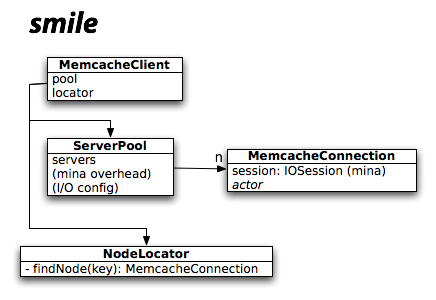

=====
SMILE
=====

Smile is a memcache library for scala which is intended to be fast and highly
concurrent. It is open-sourced under the ISC license.

All the standard key hashing functions are supported (CRC-ITU, FNV, and
Ketama). Support for round-robin ("default") and Ketama key distributions is
built-in. User-defined key hashing and distribution functions can be trivially
added via the API.

Server lists and configuration may be set manually or via configgy
<http://www.lag.net/configgy> blocks. User-defined key hashing and
distribution may be specified in the config block -- just be sure to add them
via the API first! :)

Author: Robey Pointer <robeypointer@gmail.com>

.. contents::

Strategy
========

Mina <http://mina.apache.org/> is used as a library for handling asynchronous
I/O via java NIO, and the memcache protocol is implemented using the naggati
DSL for building Mina protocol state machines. I/O events are forwarded to
scala actors, with one actor for each memcache server connection. It acts like
a thread-pool but ensures that each server's traffic is handled sequentially,
with very simple code.

Performance
===========

A performance test is included as an ant target. It requires you to have 3 memcached servers running on localhost, on ports 11211, 11212, and 11213::

    $ ant manygets
    manygets:
         [java] serial gets: 1000
         [java] toasters: 1000 in 797 msec (0.80 msec each)
         [java] parallel gets: 1000 on 10 threads
         [java] toasters: 10000 in 2992 msec (0.30 msec each)
         [java] parallel gets: 1000 on 10 threads from 3 servers
         [java] toasters: 10000 in 2048 msec (0.20 msec each)
         

The first test does 1000 memcache "get" operations in a row, from a single
thread. The second does 1000 each from 10 different threads, to verify that
performance increases. The third does the same test but randomly picks one of
three memcache servers for each "get", to simulate a real-world environment
where you would have more than one memcache server, and could run operations
on each server in parallel.

API
===

To get/set UTF-8 strings using a single-node memcache cluster on localhost::

    val cache = MemcacheClient.create(Array("localhost"), "default", "crc32-itu")
    cache.set("name", "smile")
    cache.get("name")

TO-DO
=====

- Add Future API to allow get/set to happen in the background while you do
  other work. Wait, this may not be necessary. Scala lets you trivially turn
  any operation into a future.

- Support more than just get and set. At least delete, add, and append.

- Expose the stats command in some useful way.

